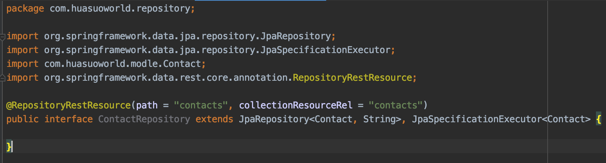

# faas 函数即服务

传统的微服务架构当中我们需要考虑方方面面：cpu，memory，disk，os update，io，application updates，network configurations，container configrations，k8s configrations，etc，而新兴的serverless为程序员抹平了这些，从devops过度到了NoOps。

faas使用场景有：

```
机器学习与数据训练

分布式流处理

用户seesion，购物车，缓存

分布式、弹性节点
```


faas CRDTs(from：https://www.youtube.com/watch?v=J3PyYmdTsnQ by：Jonas Bonér, Lightbend Inc， KubeCon / CloudNativeCon Europe 2019)：


提起faas（function as a service）就要从云计算行业先驱aws的 lambda讲起，下面摘自AWS官网：

```
AWS Lambda 是一项[无服务器计算](https://aws.amazon.com/serverless/)服务，可运行代码来响应事件并为您自动管理底层计算资源。
```


lambda虽好但是需要购买aws服务、公司的服务器是自建或者其他云厂商的等因素，那能不能搭建一套属于自己的lambda呢？

市面上流行的开源函数式编程的产品有openwish、kubeless等，这两款都比较成熟，如果微服务框架是k8s，那么kubeless原生的比较合适。但是open wish，kubeless使用起来还是略微有些繁琐，对于开发需要掌握比较多的知识，便捷性还达不到lambda的程度。那有没有一款框架能使我们开发人员快速开发功能呢？那么serverless framework的优势就出来了，它主要解决的是 从生成函数式项目 到部署到各个函数式编程产品到k8s或者aws的一款框架。

到此我们有了类lambda函数式编程中的函数部分，那么数据库部分怎么解决？传统的关系型数据库放在函数上肯定不行，但是google的firebase却能解决这种函数式编程中的数据库调用问题。还是一样的问题：我们有没有替代的解决方案呢？

java程序员熟悉的一个框架spring data rest 就是解决数据库层自动暴露api的框架，比如我们建立好数据库，那么我们可以用idea插件快速生成所有表的modle和repository，spring data rest 帮我们创建好的repository的所有接口暴露成api。到此firebase的问题也解决了。


我们该怎么用？使用场景是啥？我们下面通过一个demo来演示从数据库到函数调用再到app，我使用的是kubeless做为演示。

准备部分（请修改demo的localhost等htpp地址）：

1、部署k8s

​	请参考

​	https://github.com/huasuoworld/k8s_knowledge/blob/master/kubernetes_cluster_setup.MD

2、部署kubeless

```bash
kubectl create ns kubeless
kubectl create -f https://github.com/kubeless/kubeless/releases/download/v1.0.5/kubeless-v1.0.5.yaml 
```

3、部署serverless

```bash
 npm install -g serverless
```


使用部分：

1、创建kubeless

```bash
serverless create --template kubeless-nodejs --path serverless_project
```


2、hello world

```yaml
# For full config options, check the kubeless plugin docs:
#    https://github.com/serverless/serverless-kubeless
#
# For documentation on kubeless itself:
#    http://kubeless.io

# Update the service name below with your own service name
service: serverless-project

# Please ensure the serverless-kubeless provider plugin is installed globally.
# $ npm install -g serverless-kubeless
#
# ...before installing project dependencies to register this provider.
# $ npm install

provider:
  name: kubeless
  runtime: nodejs8

plugins:
  - serverless-kubeless

functions:
  capitalize:
    handler: handler.capitalize
```

请注意nodejs7.5以下不支持await

```js
'use strict';

module.exports = {
  capitalize(event, context) {
    return 'hello world';
  },
};
```

部署

```bash
serverless deploy -v
```


3、暴露k8s api

kubectl proxy -p 8080

4、检查函数是否正常

安装kubeless-ui

```
kubectl create -f https://raw.githubusercontent.com/kubeless/kubeless-ui/master/k8s.yaml
```


http://localhost:8080/api/v1/namespaces/default/services/capitalize:http-function-port/proxy/


5、创建mysql表

```sql
CREATE TABLE `contact` (
  `id` varchar(255) COLLATE utf8_unicode_ci NOT NULL,
  `email` varchar(255) COLLATE utf8_unicode_ci DEFAULT NULL,
  `image_url` varchar(255) COLLATE utf8_unicode_ci DEFAULT NULL,
  `name` varchar(255) COLLATE utf8_unicode_ci DEFAULT NULL,
  `phone` varchar(255) COLLATE utf8_unicode_ci DEFAULT NULL,
  PRIMARY KEY (`id`)
) ENGINE=MyISAM DEFAULT CHARSET=utf8 COLLATE=utf8_unicode_ci
```


6、创建springboot项目

```xml
<project xmlns="http://maven.apache.org/POM/4.0.0" xmlns:xsi="http://www.w3.org/2001/XMLSchema-instance"
  xsi:schemaLocation="http://maven.apache.org/POM/4.0.0 http://maven.apache.org/maven-v4_0_0.xsd">
  <modelVersion>4.0.0</modelVersion>
  <groupId>com.huasuoworld</groupId>
  <artifactId>contact</artifactId>
  <packaging>jar</packaging>
  <version>1.0-SNAPSHOT</version>
  <name>contact</name>
  <url>http://maven.apache.org</url>

  <parent>
    <groupId>org.springframework.boot</groupId>
    <artifactId>spring-boot-starter-parent</artifactId>
    <version>2.1.8.RELEASE</version>
    <relativePath/> <!-- lookup parent from repository -->
  </parent>
  
  <dependencies>
    <dependency>
      <groupId>org.springframework.boot</groupId>
      <artifactId>spring-boot-starter-data-jpa</artifactId>
    </dependency>
    <dependency>
      <groupId>org.projectlombok</groupId>
      <artifactId>lombok</artifactId>
      <optional>true</optional>
    </dependency>
    <dependency>
      <groupId>org.springframework.hateoas</groupId>
      <artifactId>spring-hateoas</artifactId>
    </dependency>
    <dependency>
      <groupId>mysql</groupId>
      <artifactId>mysql-connector-java</artifactId>
      <!--      <version>5.1.47</version>-->
      <scope>runtime</scope>
    </dependency>
    <dependency>
      <groupId>org.springframework.boot</groupId>
      <artifactId>spring-boot-starter-data-rest</artifactId>
    </dependency>
  </dependencies>

  <dependencyManagement>
    <dependencies>
      <dependency>
        <groupId>org.springframework.data</groupId>
        <artifactId>spring-data-releasetrain</artifactId>
        <version>Lovelace-SR10</version>
        <scope>import</scope>
        <type>pom</type>
      </dependency>
    </dependencies>
  </dependencyManagement>
</project>
```


7、自动生成modle和repository



8、修改hello world 函数

将hello world 函数改造一下

```
# Welcome to Serverless!
#
# For full config options, check the kubeless plugin docs:
#    https://github.com/serverless/serverless-kubeless
#
# For documentation on kubeless itself:
#    http://kubeless.io

# Update the service name below with your own service name
service: serverless-project

# Please ensure the serverless-kubeless provider plugin is installed globally.
# $ npm install -g serverless-kubeless
#
# ...before installing project dependencies to register this provider.
# $ npm install

provider:
  name: kubeless
  runtime: nodejs8

plugins:
  - serverless-kubeless

functions:
  contact:
    handler: handler.contact
```

```js
'use strict';

const axios = require('axios')

module.exports = {
  async contact(event, context) {
      let a = new Date();
      console.log(event.extensions.request.headers)
      console.log(event.data)

      let baseurl = event.extensions.request.headers.baseurl
      if(!baseurl) {
          return "baseurl is null!"
      }

      const options = {
        method: "GET",
        url: baseurl + "/contacts",
        data: {page: 0, size: 20}
      }

      let req = await axios(options)
      console.log(req.data)
      console.log("GET /hello/world 304 " + (a  - (new Date())) + " ms - -")
      return req.data
  },
}

```

9.新增traefix路由

参考traefix01.yaml,traefix02.yaml,traefix03.yaml,contact.yml

检查下数据是否已经出来

http://localhost:8000/contact


如有疑问请联系huasuoworld@outlook.com


参考文献：

https://aws.amazon.com/cn/lambda/

https://serverless.com/

https://kubeless.io/

https://kubernetes.io/